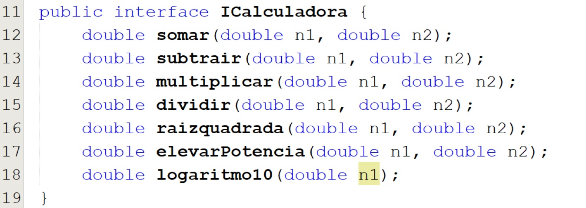

# exercicios
<!-- 1) Crie uma classe ContaCorrente que obedeça à descrição abaixo:

•A classe possui o atributo saldo do tipo float e os métodos definirSaldoInicial, depositar e sacar.

•O método definirSaldoInicial deve atribuir o valor passado por parâmetro ao atribuito saldo

•O método depositar, deve adicionar o valor passado por parâmetro ao atributo saldo

•O método sacar deve reduzir o valor passado por parâmetro do saldo já existente

•Necessário verificar a condição do valor do saldo ser insuficiente para o saque que se deseja fazer.

•O valor de retorno deve ser true (verdadeiro) quando for possível realizar o saque e false (falso) quando não for possível (public bool sacar(float valor))

•Crie um objeto novaConta do tipo ContaCorrente.

•Chame o método definirSaldoInicial passando o valor 1000 como parâmetro.

•Escreva o valor do atributo saldo

•Realize um saque de 500 reais (utilize o método sacar).

•Faça um depósito de 50 reais (utilize o método depositar)

•Escreva o valor do atributo saldo na tela.

•Realize um saque de 600 reais.

Escreva o valor do atributo saldo na tela -->

<!-- 2) Crie uma classe FormaGeometrica com um método calcularArea(). Em seguida, crie uma classe Triangulo que herda da classe FormaGeometrica e sobrescreve o método calcularArea() para calcular a área do triângulo e imprimir o resultado. -->

<!-- 3) Crie uma classe Casa com um método calcularPreco(int tamanho) que retorna o preço da casa com base no tamanho em metros quadrados. Sobrecarregue o método calcularPreco() para aceitar um número de quartos e retornar o preço da casa com base no tamanho e no número de quartos. -->

4) Você foi contratado para desenvolver um sistema de pagamento para uma loja online. A loja oferece diferentes métodos de pagamento, como cartão de crédito, PayPal e PIX. Cada método de pagamento possui um conjunto específico de informações e processos para completar uma transação.

•Crie uma classe abstrata chamada MetodoPagamento com os seguintes atributos:

• nomeMetodo String : O nome do método de pagamento

•idPagamento int : Um identificador único para a pagamento

Implemente um construtor na classe MetodoPagamento que aceite o nome do método e gere um idPagamento aleatório.

Crie três classes que herdam de MetodoPagamento : CartaoCreditoPagamento , PayPalPagamento e PIXPagamento

Cada classe filha deve implementar os seguintes métodos:

•processaPagamento (double valor): Simula o processamento do pagamento e imprime uma mensagem indicando o método de pagamento e o valor.

•mostraDetalhesPagamento (): Exibe os detalhes da transação, incluindo o método de pagamento e o idPagamento

Crie um programa principal ( main ) que demonstre o uso das classes. Crie instâncias de cada classe de método de pagamento, chame os métodos para processar o pagamento e exibir os detalhes.

Lembre se de que as classes CartaoCreditoPagamento , PayPalPagamento e PIXPagamento devem herdar da classe abstrata MetodoPagamento

5) Implemente a interface abaixo

